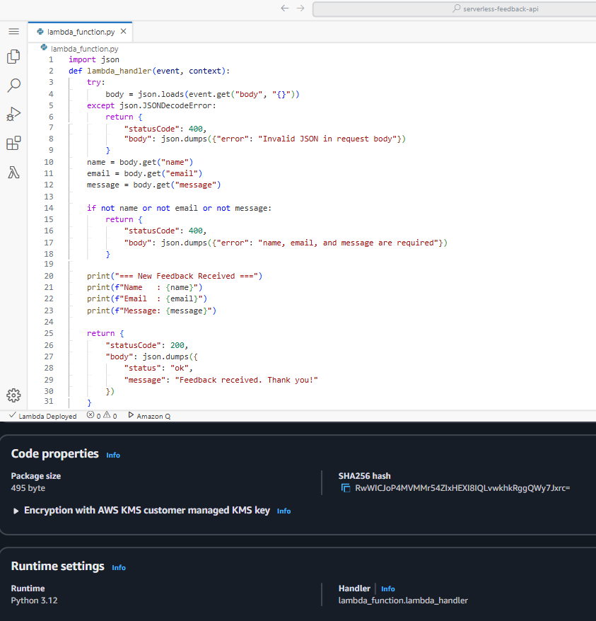
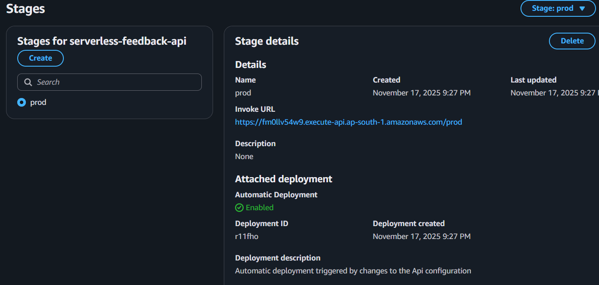

# Serverless Feedback API (AWS Lambda + API Gateway)

A fully serverless feedback API built with AWS Lambda, API Gateway, and Python — deployed on AWS.

📌 Overview
This project is a serverless feedback API built on AWS using Lambda (Python) and API Gateway (HTTP API).
The API accepts a JSON payload containing name, email, role, and message, performs basic validation, logs the feedback to CloudWatch Logs, and returns a structured JSON response. It is designed to run fully on AWS using a serverless architecture.

🏗 Architecture
Client (Thunder Client / Postman / Frontend)
→ Amazon API Gateway (HTTP API)
→ AWS Lambda (Python 3.12)
→ Amazon CloudWatch Logs

🛠 Tech Stack

AWS Lambda – Python 3.12 runtime

Amazon API Gateway (HTTP API) – public HTTPS endpoint

AWS IAM – execution role with basic Lambda permissions

Amazon CloudWatch Logs – centralized logging & debugging

Thunder Client / Postman – for API testing

🔌 Endpoint

> 🔔 Note: This API supports **POST** requests only.  
> Opening the URL in a browser will show **"Not Found"** because browsers send **GET** requests by default.  
> Use Thunder Client / Postman to test the API with JSON input.

Method: POST

URL:

https://fm0llv54w9.execute-api.ap-south-1.amazonaws.com/prod/feedback

Headers:

Content-Type: application/json

📤 Sample Request

{
  "name": "Pravin Kumar S",
  "email": "pravinkumar25062004@gmail.com",
  "role": "Cloud & Python Enthusiast",
  "message": "Testing my AWS Serverless Feedback API built with API Gateway and Lambda (Python). The architecture is event-driven, scalable, and runs fully within the AWS Free Tier. Excited to apply these cloud skills in real-world projects."
}

📥 Sample Response

{
  "status": "ok",
  "message": "Feedback received. Thank you!"
}

🧠 Lambda Function (Core Logic)

The Lambda function:

Parses the JSON request body

Validates required fields (name, email, message)

Logs the feedback into CloudWatch Logs

Returns a clean JSON response

(Full code is available in lambda_function.py.)

📸 Demo Screenshots

1️⃣ AWS Lambda – Python Implementation  

2️⃣ API Test – Thunder Client (200 OK)  

3️⃣ API Gateway – Prod Stage & Invoke URL  

✅ Features

Fully serverless, no servers to manage

Backend built with Python AWS Lambda

Validates required fields: name, email, message

Logs feedback into CloudWatch Logs

Runs on a highly scalable, cost-efficient serverless infrastructure

Works with any frontend that supports HTTPS POST requests

💼 Use Cases

Contact / feedback form backend for portfolio websites

Lightweight logging & event ingestion API

Serverless backend for PoC or demo applications

Strong portfolio project for Cloud / DevOps / Backend engineer roles

👤 About the Developer

Name: Pravin Kumar S
Role: Cloud & Python Enthusiast
Passionate about cloud computing, serverless architectures, Python automation, and building real-world projects on AWS.

